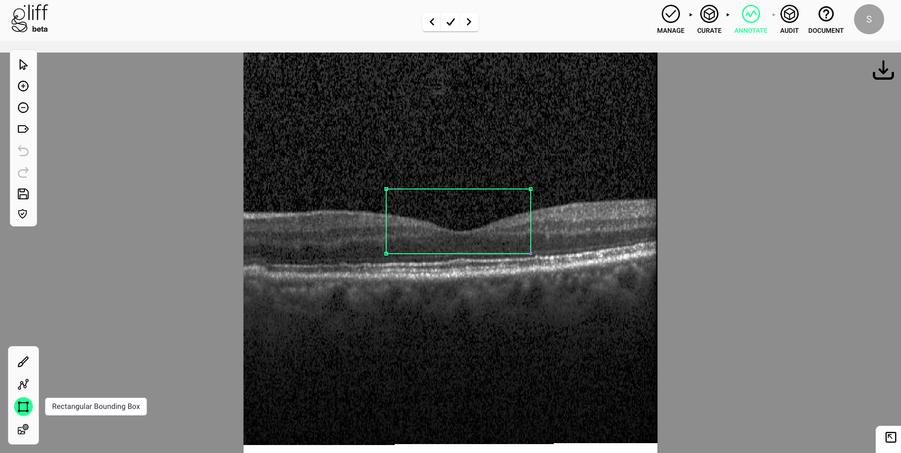

# Splines, Areas and Boxes

Whilst the paintbrush is the primary functionality within the annotation interface. There are also a host of options for drawing with splines and other tools to create linear and boundary annotations.

_Tip: Begin a new annotation when switching between tools, see Annotation Management section of [Annotation: First Steps](/firststeps) for further instructions._

## Splines

Open the splines panel by clicking the **Spline** button.

### Ordinary Spline

The ordinary spline allows you to precisely place nodes where you desire.
Click the **Spline** button in the spline panel to activate.
Each individual click you make on the canvass will place an additional node sequentially in the spline.
Placed nodes can be subsequently moved by clicking and dragging them across the canvass.

_Tip: To stop placing nodes for a spline, you must begin a new annotation, see Annotation Management section of [Annotation: First Steps](/firststeps) for further instructions._

If you wish to turn your annotation into a closed shape, please click the **Close Active Spline** button.

### Lasso spline

The lasso spline allows you to rapidly draw a shape by clicking and dragging the cursor around a desired area.
Click the **Lasso Spline** button in the spline panel to activate.
By clicking on the canvass, and dragging around the desired area, a number of spline nodes will be placed to best represent the path of the cursor.
Additional clicks will place individual nodes in a similar way to the ordinary spline.
Placed nodes can be subsequently moved by clicking and dragging them across the canvass.

_Tip: To stop placing nodes for a spline, you must begin a new annotation, see Annotation Management section of [Annotation: First Steps](/firststeps) for further instructions._

If you wish to turn your annotation into a closed shape, please click the **Close Active Spline** button.

### Convert Spline to Paintbrush

Clicking the **Convert Spline to Paintbrush** will convert the current spline annotation into an equivalent brushstroke annotation.
This new brushstroke annotation can be manipulated as with any other created using the paintbrush.
By subsequently using **Fill Active Paintbrush** this can be an easy way to create solid area annotations.

_Tip: Learn more on Paintbrushes at [Annotation: Paintbrush](/paintbrush)._

## Rectangular Bounding Box

The **Rectangular Bounding Box** allows you to draw a straight forward rectangle annotation around a given area.
First, click to select the top left corner position, then click the bottom right corner position.
The position of any corner can be altered by clicking on the corner and dragging to a new position.
